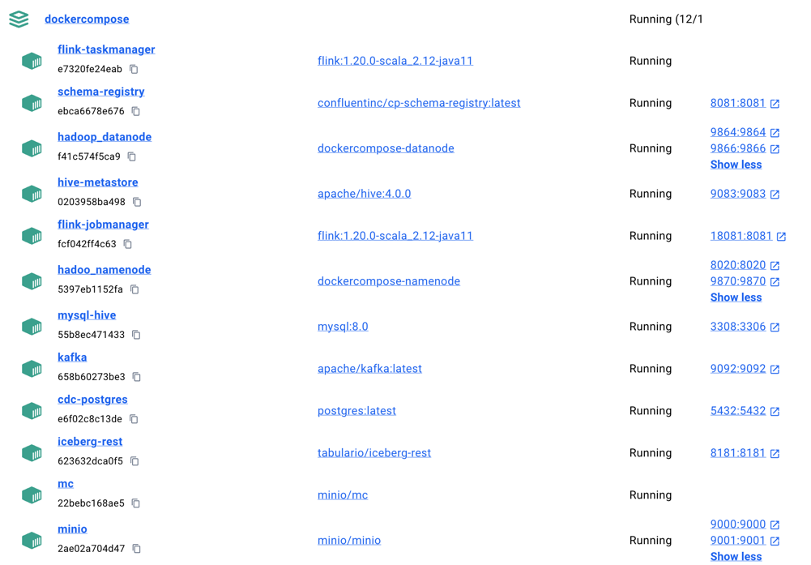
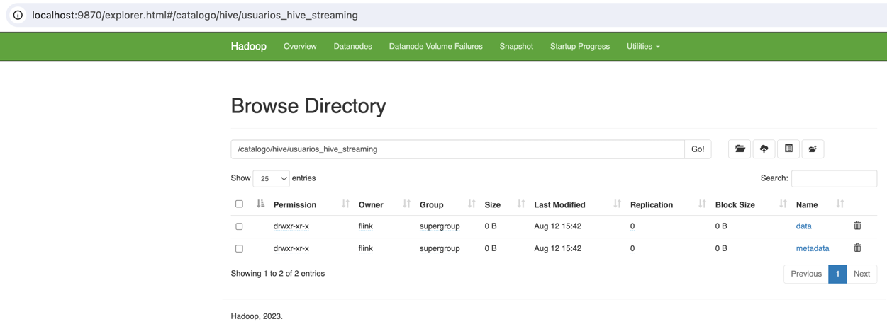

# Tabla de contenidos

1. [Arquitectura de Referencia](#Modelo-de-Referencia)
2. [Alcance](#Alcance)
3. [Teoria](#Teoria)
   - [FLink Primitivas: Evento, Estado y Tiempo](#Apache-Flink)
   - [Iceberg Catalogo: HDFS, Hive, Rest](#Apache-Iceberg)
4. [Trabajo en Proceso](#Trabajos-Pendientes-o-En-Proceso)
5. [Stack Tecnológico](#Stack-Tecnológico)
6. [Arquitectura](#Arquitectura)
7. [Configuración del Proyecto](#Configuración-del-Proyecto)
8. [Iniciar Infraestructura Base](#Iniciar-Infraestructura-Base)
9. [Casos de Uso de Ejemplo Implementados](#Casos-de-Uso-de-Ejemplo-Implementados)
   - [CDC Postgres / Kafka / Flink / Join](#change-data-capture--flink--kafka--join--flink-sum--flink-count)
   - [Flink hacia Iceberg HDFS](#flink--iceberg-hdfs)
   - [Flink hacia Iceberg Hive](#flink--iceberg-hive)
   - [Flink hacia Iceberg Minio](#flink--iceberg-minio)

# Modelo de Referencia

En este proyecto, se implementa una arquitectura de referencia utilizando un stack de tecnologías robusto y moderno para el procesamiento y evolución de data.

# Alcance

- Los ejemplos para cada uno de los casos de uso pueden correrse en el host sin problemas usando Flink Standalone,
- Los ejemplos para cada uno de los casos de uso pueden correrse como contenedores sin problemas usando Flink CLuster en contenedores,
- Se proporciona una arquitectura base con los componentes mas comunes para un flujo de datos eficiente y escalable,
- Versiones usadas:
  - Apache Kafka: Version 3.7.1 (release 28 Junio 2024)
  - Apache Flink: Version 1.20.0 (release 02 Agosto 2024)
  - Apache Iceberg: Version 1.6.0 (release 23 Julio 2024)

# Teoria

## Apache Flink


### Primitiva Evento


### Primitva Estado


### Primitva Tiempo


## Apache Iceberg

### Opciones de Catalogo


# Trabajos Pendientes o En Proceso

- [ ] Apache Iceberg con Minio.
- [ ] Apache Flink EOS Sistemas Soportan Semantica Unica por configuracion (Ejemplo: Kafka - Flink - Kafka).
- [ ] Apache Flink EOS Sistemas que NO Soportan Semantica Unica por configuracion (Ejemplo: Kafka - REST Externo - Flink - REST Externo).
- [ ] Apache Iceberg Query
- [ ] Apache Flink Table
- [ ] Apache Flink SQL

# Stack Tecnológico

Las tecnologías usadas en este proyecto incluyen:

1. Postgres CDC
2. Debezium
3. Apache Flink
4. Apache Kafka
5. Flink Tumbling Processing Time Window
6. Flink Count y envío de data hacia Kafka
7. Flink Sum y envío de data hacia Kafka
8. Apache Iceberg
9. Catalogo Iceberg HDFS
10. Catalogo Icerber Hive

Estas tecnologías trabajan en conjunto para capturar, procesar, y almacenar cambios en los datos.

# Arquitectura

En este proyecto se implementa una arquitectura utilizando Apache Kafka, Apache Flink y Apache Iceberg. Estas tecnologías trabajan juntas para asegurar un flujo de datos eficiente y escalable.

# Configuración del Proyecto

## Descargar proyecto
```bash
$ git clone https://github.com/davisusanibar/data-evolutionary.git
```

## Linter Codigo
```bash
$ cd data-evolutionary/data-cdc-kafka-flink-iceberg
$ mvn spotless:check
$ mvn spotless:apply
...
[INFO] Spotless.Java is keeping 24 files clean - 2 were changed to be clean, 22 were already clean, 0 were skipped because caching determined they were already clean
...
```

## Crear paquete de despliegue para cargar a Flink
```bash
$ cd data-evolutionary/data-cdc-kafka-flink-iceberg
$ mvn clean package
$ ls -1 target/data-cdckafkaflinkiceberg-1.0-SNAPSHOT-shaded.jar
|_ target/data-cdckafkaflinkiceberg-1.0-SNAPSHOT-shaded.jar
``` 

# Iniciar Infraestructura Base

## Configurar mapeo local de hosts

Obtener la IP local y registrar los hostname asociados a tu IP.

```bash
$ ifconfig | grep "inet " | grep -v 127.0.0.1                                                      ✔  at 12:33:48 AM  
        inet 192.168.18.5 netmask 0xffffff00 broadcast 192.168.18.255
$ cat /etc/hosts
# Topaya:
192.168.18.5  namenode
192.168.18.5  datanode
192.168.18.5  postgres
192.168.18.5  schema-registry
192.168.18.5  broker
192.168.18.5  registry
192.168.18.5  hive
192.168.18.5  rest
192.168.18.5  warehouse.minio
```

## Usando docker compose

```bash
$ cd infra/dockercompose 
$ docker compose up -d
$ docker compose ps
|_ NAME                IMAGE                                    COMMAND                  SERVICE             CREATED          STATUS          PORTS
|_ cdc-postgres        postgres:latest                          "docker-entrypoint.s…"   postgres            12 hours ago     Up 12 hours     0.0.0.0:5432->5432/tcp
|_ flink-jobmanager    flink:1.20.0-scala_2.12-java11           "/docker-entrypoint.…"   flink-jobmanager    12 hours ago     Up 12 hours     6123/tcp, 0.0.0.0:18081->8081/tcp
|_ flink-taskmanager   flink:1.20.0-scala_2.12-java11           "/docker-entrypoint.…"   flink-taskmanager   12 hours ago     Up 12 hours     6123/tcp, 8081/tcp
|_ hadoo_namenode      dockercompose-namenode                   "/usr/local/bin/dumb…"   namenode            12 hours ago     Up 12 hours     0.0.0.0:8020->8020/tcp, 0.0.0.0:9870->9870/tcp
|_ hadoop_datanode     dockercompose-datanode                   "/usr/local/bin/dumb…"   datanode            12 hours ago     Up 12 hours     0.0.0.0:9864->9864/tcp, 0.0.0.0:9866->9866/tcp
|_ hive-metastore      apache/hive:4.0.0                        "sh -c /entrypoint.sh"   hive                12 hours ago     Up 12 hours     10000/tcp, 0.0.0.0:9083->9083/tcp, 10002/tcp
|_ iceberg-rest        tabulario/iceberg-rest                   "java -jar iceberg-r…"   rest                17 minutes ago   Up 17 minutes   0.0.0.0:8181->8181/tcp
|_ kafka               apache/kafka:latest                      "/__cacert_entrypoin…"   broker              12 hours ago     Up 12 hours     0.0.0.0:9092->9092/tcp
|_ mc                  minio/mc                                 "/bin/sh -c ' until …"   mc                  17 minutes ago   Up 17 minutes   
|_ minio               minio/minio                              "/usr/bin/docker-ent…"   minio               17 minutes ago   Up 17 minutes   0.0.0.0:9000-9001->9000-9001/tcp
|_ mysql-hive          mysql:8.0                                "docker-entrypoint.s…"   mysql-hive          12 hours ago     Up 12 hours     33060/tcp, 0.0.0.0:3308->3306/tcp
|_ schema-registry     confluentinc/cp-schema-registry:latest   "/etc/confluent/dock…"   schema-registry     12 hours ago     Up 12 hours     0.0.0.0:8081->8081/tcp

```



## Usando Kubernetes

TBD

# Casos de Uso de Ejemplo Implementados

## Change Data Capture / Flink / Kafka / Join / Flink SUM / Flink COUNT

Ejemplo completo en: [JobStreamingCDCKafkaFlink.java](data-cdc-kafka-flink-iceberg%2Fsrc%2Fmain%2Fjava%2Fcom%2Ftopaya%2Fcdckafkaflinkiceberg%2Fe_cdckafkaflink%2FJobStreamingCDCKafkaFlink.java)


## Flink / Iceberg HDFS

Ejemplo completo en: [JobDataStreamToIcebergToHadoopCatalogo.java](data-cdc-kafka-flink-iceberg%2Fsrc%2Fmain%2Fjava%2Fcom%2Ftopaya%2Fcdckafkaflinkiceberg%2Fd_iceberg%2Fhadoop_hdfs%2Fstreaming%2FJobDataStreamToIcebergToHadoopCatalogo.java)


## Flink / Iceberg Hive

Ejemplo completo en: [JobStreamingDataStreamToIcebergToHiveCatalogo.java](data-cdc-kafka-flink-iceberg%2Fsrc%2Fmain%2Fjava%2Fcom%2Ftopaya%2Fcdckafkaflinkiceberg%2Fd_iceberg%2Fhadoop_hive%2Fstreaming%2FJobStreamingDataStreamToIcebergToHiveCatalogo.java)





## Flink / Iceberg Minio

Ejemplo completo en: [JobStreamingDataStreamToIcebergToMinio.java](data-cdc-kafka-flink-iceberg%2Fsrc%2Fmain%2Fjava%2Fcom%2Ftopaya%2Fcdckafkaflinkiceberg%2Fd_iceberg%2Fminio%2Fstreaming%2FJobStreamingDataStreamToIcebergToMinio.java)


