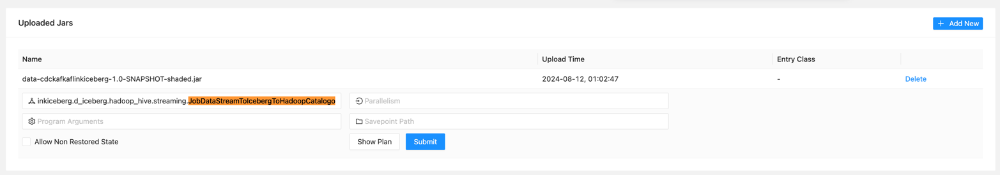
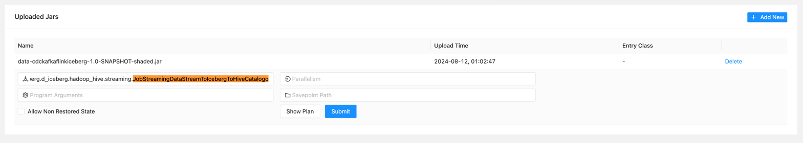

# Caso de Uso: Apache Flink Iceberg - HDFS & HIVE Catalogo

# Construir Proyecto

## Descargar proyecto
```bash
$ git clone https://github.com/davisusanibar/data-evolutionary.git
```

## Generar Modelos Avro
```bash
$ cd data-evolutionary/data-cdc-kafka-flink-iceberg
$ mvn clean compime
$ ls -1 target/generated-sources/avro/com/topaya/cdckafkaflinkiceberg/model/avro
|_ Customer.java
|_ CustomerTotalCount.java
|_ CustomerTotalPrice.java
|_ OrderEnrichment.java
|_ Orders.java
|_ o_totalprice.java
```

## Linter Codigo
```bash
$ cd data-evolutionary/data-cdc-kafka-flink-iceberg
$ mvn spotless:check
$ mvn spotless:apply
...
[INFO] Spotless.Java is keeping 24 files clean - 2 were changed to be clean, 22 were already clean, 0 were skipped because caching determined they were already clean
...
```

## Crear paquete de despliegue para cargar a Flink
```bash
$ cd data-evolutionary/data-cdc-kafka-flink-iceberg
$ mvn clean package
$ ls -1 target/data-cdckafkaflinkiceberg-1.0-SNAPSHOT-shaded.jar
|_ target/data-cdckafkaflinkiceberg-1.0-SNAPSHOT-shaded.jar
```

# Iniciar Infraestructura Base

## Configurar mapeo local de hosts

Obtener la IP local y registrar los hostname asociados a tu IP.

```bash
$ ifconfig | grep "inet " | grep -v 127.0.0.1                                                      ✔  at 12:33:48 AM  
        inet 192.168.18.5 netmask 0xffffff00 broadcast 192.168.18.255
$ sudo vim /etc/hosts
$ cat /etc/hosts
# Topaya:
192.168.18.5  namenode
192.168.18.5  datanode
192.168.18.5  postgres
192.168.18.5  schema-registry
192.168.18.5  broker
192.168.18.5  registry
192.168.18.5  hive
```

## Usando docker compose
```bash
$ cd infra/dockercompose 
$ docker compose up -d
$ docker compose ps
|_ NAME                IMAGE                                    COMMAND                  SERVICE             CREATED       STATUS       PORTS
|_ cdc-postgres        postgres:latest                          "docker-entrypoint.s…"   postgres            2 hours ago   Up 2 hours   0.0.0.0:5432->5432/tcp
|_ flink-jobmanager    flink:1.20.0-scala_2.12-java11           "/docker-entrypoint.…"   flink-jobmanager    2 hours ago   Up 2 hours   6123/tcp, 0.0.0.0:18081->8081/tcp
|_ flink-taskmanager   flink:1.20.0-scala_2.12-java11           "/docker-entrypoint.…"   flink-taskmanager   2 hours ago   Up 2 hours   6123/tcp, 8081/tcp
|_ hadoo_namenode      dockercompose-namenode                   "/usr/local/bin/dumb…"   namenode            2 hours ago   Up 2 hours   0.0.0.0:8020->8020/tcp, 0.0.0.0:9870->9870/tcp
|_ hadoop_datanode     dockercompose-datanode                   "/usr/local/bin/dumb…"   datanode            2 hours ago   Up 2 hours   0.0.0.0:9864->9864/tcp, 0.0.0.0:9866->9866/tcp
|_ hive-metastore      apache/hive:4.0.0                        "sh -c /entrypoint.sh"   hive                2 hours ago   Up 2 hours   10000/tcp, 0.0.0.0:9083->9083/tcp, 10002/tcp
|_ kafka               apache/kafka:latest                      "/__cacert_entrypoin…"   broker              2 hours ago   Up 2 hours   0.0.0.0:9092->9092/tcp
|_ mysql-hive          mysql:8.0                                "docker-entrypoint.s…"   mysql-hive          2 hours ago   Up 2 hours   33060/tcp, 0.0.0.0:3308->3306/tcp
|_ schema-registry     confluentinc/cp-schema-registry:latest   "/etc/confluent/dock…"   schema-registry     2 hours ago   Up 2 hours   0.0.0.0:8081->8081/tcp
```

## Usando Kubernetes

TBD

# Prueba de Componentes

## Apache Flink - Apache Iceberg - Catalogo HDFS




## Apache Flink - Apache Iceberg - Catalogo HIVE




# Limpieza

En caso se vea lentitud, intermitencia o se realicen cambios se recomienda iniciar todo el proceso desde cero, de la siguiente manera:

```xml
$ cd infra/dockercompose
$ docker compose ps
$ docker compose stop
$ docker compose rm
$ docker compose down --volumes
$ rm -rf datanode_data/* hive_database/*
$ docker compose up -d
```

