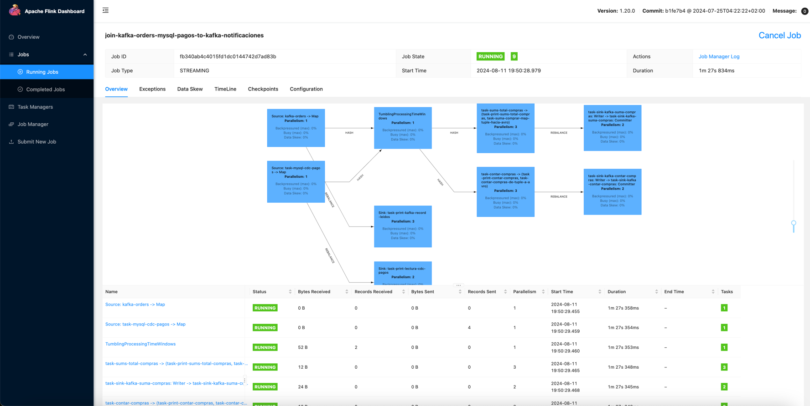
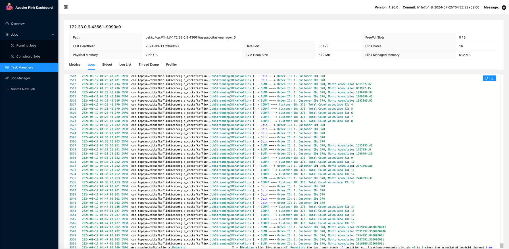

# Caso de Uso: CDC, Flink Join, Sum, Count, Kafka

Postgres CDC, Debezium, FLink, Kafka, FLink Tumbling Processing Time Window, Fink Count hacia Kafka, Flink Sum hacia Kafka

Para correr el ejemplo ejecutar los pasos mencionados en: Construir proyecto, Iniciar infraestructure y Prueba de componente.

# Tabla de contenidos
1. [Construir Proyecto](#Construir-Proyecto)
2. [Infraestructura](#Iniciar-Infraestructura-Base)
3. [Pruebas](#Prueba-de-Componentes)
4. [Detalle Implementación](#Implementacion-del-caso-de-uso)
5. [Limpieza del ambiente](#Limpieza)

# Construir Proyecto

## Descargar proyecto
```bash
$ git clone https://github.com/davisusanibar/data-evolutionary.git
```

## Generar Modelos Avro
```bash
$ cd data-evolutionary/data-cdc-kafka-flink-iceberg
$ mvn clean compime
$ ls -1 target/generated-sources/avro/com/topaya/cdckafkaflinkiceberg/model/avro
|_ Customer.java
|_ CustomerTotalCount.java
|_ CustomerTotalPrice.java
|_ OrderEnrichment.java
|_ Orders.java
|_ o_totalprice.java
```

## Linter Codigo
```bash
$ cd data-evolutionary/data-cdc-kafka-flink-iceberg
$ mvn spotless:check
$ mvn spotless:apply
...
[INFO] Spotless.Java is keeping 24 files clean - 2 were changed to be clean, 22 were already clean, 0 were skipped because caching determined they were already clean
...
```

## Crear paquete de despliegue para cargar a Flink
```bash
$ cd data-evolutionary/data-cdc-kafka-flink-iceberg
$ mvn clean package
$ ls -1 target/data-cdckafkaflinkiceberg-1.0-SNAPSHOT-shaded.jar
|_ target/data-cdckafkaflinkiceberg-1.0-SNAPSHOT-shaded.jar
```

# Iniciar Infraestructura Base

## Configurar mapeo local de hosts

Obtener la IP local y registrar los hostname asociados a tu IP.

```bash
$ ifconfig | grep "inet " | grep -v 127.0.0.1                                                      ✔  at 12:33:48 AM  
        inet 192.168.18.5 netmask 0xffffff00 broadcast 192.168.18.255
$ sudo vim /etc/hosts
$ cat /etc/hosts
# Topaya:
192.168.18.5  namenode
192.168.18.5  datanode
192.168.18.5  postgres
192.168.18.5  schema-registry
192.168.18.5  broker
192.168.18.5  registry
192.168.18.5  hive
```

## Usando docker compose
```bash
$ cd infra/dockercompose 
$ docker compose up -d
$ docker compose ps
|_ NAME                IMAGE                                    COMMAND                  SERVICE             CREATED       STATUS       PORTS
|_ cdc-postgres        postgres:latest                          "docker-entrypoint.s…"   postgres            2 hours ago   Up 2 hours   0.0.0.0:5432->5432/tcp
|_ flink-jobmanager    flink:1.20.0-scala_2.12-java11           "/docker-entrypoint.…"   flink-jobmanager    2 hours ago   Up 2 hours   6123/tcp, 0.0.0.0:18081->8081/tcp
|_ flink-taskmanager   flink:1.20.0-scala_2.12-java11           "/docker-entrypoint.…"   flink-taskmanager   2 hours ago   Up 2 hours   6123/tcp, 8081/tcp
|_ hadoo_namenode      dockercompose-namenode                   "/usr/local/bin/dumb…"   namenode            2 hours ago   Up 2 hours   0.0.0.0:8020->8020/tcp, 0.0.0.0:9870->9870/tcp
|_ hadoop_datanode     dockercompose-datanode                   "/usr/local/bin/dumb…"   datanode            2 hours ago   Up 2 hours   0.0.0.0:9864->9864/tcp, 0.0.0.0:9866->9866/tcp
|_ hive-metastore      apache/hive:4.0.0                        "sh -c /entrypoint.sh"   hive                2 hours ago   Up 2 hours   10000/tcp, 0.0.0.0:9083->9083/tcp, 10002/tcp
|_ kafka               apache/kafka:latest                      "/__cacert_entrypoin…"   broker              2 hours ago   Up 2 hours   0.0.0.0:9092->9092/tcp
|_ mysql-hive          mysql:8.0                                "docker-entrypoint.s…"   mysql-hive          2 hours ago   Up 2 hours   33060/tcp, 0.0.0.0:3308->3306/tcp
|_ schema-registry     confluentinc/cp-schema-registry:latest   "/etc/confluent/dock…"   schema-registry     2 hours ago   Up 2 hours   0.0.0.0:8081->8081/tcp
```

## Usando Kubernetes

TBD

# Prueba de Componentes

## Flink / Kafka

### Cargar Data Topico Kafka `orders`
Data Avro que se enviara hacia Topico de Kafka `orders`: src/main/resources/data/orders.avro


Envio de data:

```bash
$ cd data-evolutionary/data-cdc-kafka-flink-iceberg
$ mvn exec:java -Dexec.mainClass="com.topaya.cdckafkaflinkiceberg.utilitarios.IngestaDataHaciaTopicosKafka"
```

### Cargar proyecto usando Flink Dashboard


Despliegue de: `com.topaya.cdckafkaflinkiceberg.e_cdckafkaflink.JobStreamingCDCKafkaFlink`




### Validacion de envío de data Avro hacia topicos de kafka `orders`

Antes:


Despues:


Revisemos la tarea que imprime la cantidad de registros leidos desde el topico `orders` de kakfa (recordar que le dimos paralelismo 3, entonces la escritura sera repartida entre los 3 slots):
Antes ya había leido: 10, 10, 10. Luego llegaron 10 y los repartio entre los 3 slots como: 3, 4, 3, haciendo un total de: 13, 14, 3.


## Flink / Change Data Capture PostgreSQL

### Conexión a Postgres DB
```bash
$ docker exec -it cdc-postgres psql -h localhost -d postgres -U postgres                                       ✔  at 10:37:24 PM  
psql (16.3 (Debian 16.3-1.pgdg120+1))
Type "help" for help.

postgres=# 
```

### Validar Postgres log directory
Query + Insert:
```bash
$ docker exec -it cdc-postgres psql -h localhost -d postgres -U postgres                                       ✔  at 10:37:24 PM  
psql (16.3 (Debian 16.3-1.pgdg120+1))
Type "help" for help.

postgres=# select * from payments;
postgres=# INSERT INTO payments (order_id, customer_id, amount, create_time) VALUES (1, 4, 14.29, '1996-01-01 00:00:00');
```

Log Query + Insert:
```bash
$ docker exec -it cdc-postgres /bin/bash
$ tail -20f /var/lib/postgresql/data/pg_log/postgresql-2024-08-12_003502.log
...
2024-08-12 03:43:33.712 UTC [110] LOG:  execute S_4: SELECT 1
2024-08-12 03:43:41.371 UTC [463] LOG:  statement: select * from payments;
2024-08-12 03:43:43.931 UTC [110] LOG:  execute S_4: SELECT 1
2024-08-12 03:43:53.640 UTC [110] LOG:  execute S_4: SELECT 1
2024-08-12 03:44:01.459 UTC [463] LOG:  statement: INSERT INTO payments (order_id, customer_id, amount, create_time) VALUES (1, 4, 14.29, '1996-01-01 00:00:00');
2024-08-12 03:44:01.843 UTC [483] LOG:  statement: BEGIN
2024-08-12 03:44:01.843 UTC [483] LOG:  statement: SELECT COUNT(1) FROM pg_publication WHERE pubname = 'dbz_publication'
2024-08-12 03:44:01.844 UTC [483] LOG:  statement: COMMIT
2024-08-12 03:44:01.847 UTC [483] LOG:  starting logical decoding for slot "kcdconf01"
2024-08-12 03:44:01.847 UTC [483] DETAIL:  Streaming transactions committing after 0/155A138, reading WAL from 0/155A138.
2024-08-12 03:44:01.847 UTC [483] STATEMENT:  START_REPLICATION SLOT "kcdconf01" LOGICAL 0/155A2F8 ("proto_version" '1', "publication_names" 'dbz_publication', "messages" 'true')
2024-08-12 03:44:01.848 UTC [483] LOG:  logical decoding found consistent point at 0/155A138
2024-08-12 03:44:01.848 UTC [483] DETAIL:  There are no running transactions.
2024-08-12 03:44:01.848 UTC [483] STATEMENT:  START_REPLICATION SLOT "kcdconf01" LOGICAL 0/155A2F8 ("proto_version" '1', "publication_names" 'dbz_publication', "messages" 'true')
2024-08-12 03:44:01.875 UTC [484] LOG:  execute <unnamed>: SELECT * FROM (SELECT n.nspname,c.relname,a.attname,a.atttypid,a.attnotnull OR (t.typtype = 'd' AND t.typnotnull) AS attnotnull,a.atttypmod,a.attlen,t.typtypmod,row_number() OVER (PARTITION BY a.attrelid ORDER BY a.attnum) AS attnum, nullif(a.attidentity, '') as attidentity,nullif(a.attgenerated, '') as attgenerated,pg_catalog.pg_get_expr(def.adbin, def.adrelid) AS adsrc,dsc.description,t.typbasetype,t.typtype  FROM pg_catalog.pg_namespace n  JOIN pg_catalog.pg_class c ON (c.relnamespace = n.oid)  JOIN pg_catalog.pg_attribute a ON (a.attrelid=c.oid)  JOIN pg_catalog.pg_type t ON (a.atttypid = t.oid)  LEFT JOIN pg_catalog.pg_attrdef def ON (a.attrelid=def.adrelid AND a.attnum = def.adnum)  LEFT JOIN pg_catalog.pg_description dsc ON (c.oid=dsc.objoid AND a.attnum = dsc.objsubid)  LEFT JOIN pg_catalog.pg_class dc ON (dc.oid=dsc.classoid AND dc.relname='pg_class')  LEFT JOIN pg_catalog.pg_namespace dn ON (dc.relnamespace=dn.oid AND dn.nspname='pg_catalog')  WHERE c.relkind in ('r','p','v','f','m') and a.attnum > 0 AND NOT a.attisdropped  AND n.nspname LIKE 'public' AND c.relname LIKE 'payments') c WHERE true  ORDER BY nspname,c.relname,attnum 
2024-08-12 03:44:01.878 UTC [484] LOG:  execute <unnamed>: SELECT        result.TABLE_CAT,        result.TABLE_SCHEM,        result.TABLE_NAME,        result.COLUMN_NAME,        result.KEY_SEQ,        result.PK_NAME FROM      (SELECT NULL AS TABLE_CAT, n.nspname AS TABLE_SCHEM,   ct.relname AS TABLE_NAME, a.attname AS COLUMN_NAME,   (information_schema._pg_expandarray(i.indkey)).n AS KEY_SEQ, ci.relname AS PK_NAME,   information_schema._pg_expandarray(i.indkey) AS KEYS, a.attnum AS A_ATTNUM FROM pg_catalog.pg_class ct   JOIN pg_catalog.pg_attribute a ON (ct.oid = a.attrelid)   JOIN pg_catalog.pg_namespace n ON (ct.relnamespace = n.oid)   JOIN pg_catalog.pg_index i ON ( a.attrelid = i.indrelid)   JOIN pg_catalog.pg_class ci ON (ci.oid = i.indexrelid) WHERE true  AND n.nspname = 'public' AND ct.relname = 'payments' AND i.indisprimary  ) result where  result.A_ATTNUM = (result.KEYS).x  ORDER BY result.table_name, result.pk_name, result.key_seq
2024-08-12 03:44:03.938 UTC [484] LOG:  execute <unnamed>: SELECT 1
2024-08-12 03:44:13.649 UTC [484] LOG:  execute <unnamed>: SELECT 1
...
```

### Validar Flink CDC Postgres

Antes:


Enviar data hacia PostgreSQL:

```bash
$ docker exec -it cdc-postgres psql -h localhost -d postgres -U postgres                                       ✔  at 10:37:24 PM  
psql (16.3 (Debian 16.3-1.pgdg120+1))
Type "help" for help.

postgres=# select * from payments;
 id | order_id | customer_id | amount |     create_time     
----+----------+-------------+--------+---------------------
  1 |        1 |         370 | 100.00 | 1996-01-01 00:00:00
  2 |        1 |         370 | 200.00 | 1996-01-01 00:00:00
  3 |        1 |           4 |  14.29 | 1996-01-01 00:00:00
(3 rows)
postgres=# INSERT INTO payments (order_id, customer_id, amount, create_time) VALUES (1, 370, 14.29, '1996-01-01 00:00:00');
postgres=# INSERT INTO payments (order_id, customer_id, amount, create_time) VALUES (1, 370, 14.29, '1996-01-01 00:00:00');
postgres=# INSERT INTO payments (order_id, customer_id, amount, create_time) VALUES (1, 370, 14.29, '1996-01-01 00:00:00');
postgres=# select * from payments;
 id | order_id | customer_id | amount |     create_time     
----+----------+-------------+--------+---------------------
  1 |        1 |         370 | 100.00 | 1996-01-01 00:00:00
  2 |        1 |         370 | 200.00 | 1996-01-01 00:00:00
  3 |        1 |           4 |  14.29 | 1996-01-01 00:00:00
  4 |        1 |         370 |  14.29 | 1996-01-01 00:00:00
  5 |        1 |         370 |  14.29 | 1996-01-01 00:00:00
  6 |        1 |         370 |  14.29 | 1996-01-01 00:00:00
(6 rows)
```

Despues:


Revisemos la tarea que imprime la cantidad de registros leidos desde la BD postgres CDC (recordar que le dimos paralelismo 2, entonces la escritura sera repartida entre 2 slots):
Antes ya había leido: 3, 4. Luego llegaron 3 y los repartio entre los 2 slots como: 2, 1, haciendo un total de: 3 + 2, 4 + 1.


> Nota: La tarea de escritura en base de datos PostgreSQL y la generacion de mensajes en Topicos
Kafka tiene una ventana de 20 segundos, pasado ese tiempo el join nos los considerará:
`.window(TumblingProcessingTimeWindows.of(Time.seconds(20).toDuration()))`

## Flink Joins Tópicos Kafka con DB por CDC

### Flujo

El flujo de la demo es el siguiente:
- A = Stream PostgreSQL: Detectar los cambios en la base de datos y leerlos como streaming (Payments: order_id, customer_id).
- B = Stream Kafka Topico Orders: Creamos KafkaSource stream con la data de Kafka topico de Orders.
- C = Join A + B (a.order_id = b.get(o_orderkey))
- D = Reparticionamos la data resultado del join C por customer_id
- Flujo branch 1:
- E = Hacemos una agrupacion en stream D de montos totales de las ordenes por cliente (sum(amount))
- F = Stream montos totales por cliente E hacia topico de Kafka
- Flujo branch 1:
- G = Hacemos una agrupacion en stream D de cantidades de ordenes por cliente (count(amount))
- H = Stream cantidades totales por cliente G hacia topico de Kafka

#### Inicio: 

Tiene 45 registros, y 8 registros que se marcaron como join.


#### Join Topico Kafka + CDC Postgres:

Insertamos 10 registros en Topico Kafka.
Insertamos 5 registros en Postgres.

| Kafka     | Postgres  |
|-----------|-----------|
|  |  |

#### Detecta los joins en la ventana:

Inicio con 45 registros, llegan 10 registros por Topico Kafka `orders` + llegan 5 registros de Postgres CDC
Total: 45 inicial + 15 llegando = 60


#### Cierre de Ventana:

Paso la ventana de Join 20 segundos: `org.apache.flink.streaming.api.windowing.time.Time.seconds(20)`
Antes: 8 registros marcados como join inicial + 5 nuevos joins = 13 joins


## Flink Count / Suma

Inicio:

- Topic: notificaciones-count-order = 8
- Topic: notificaciones-montototal-order = 8
- 


Proceso:

- Insertamos 10 registros en Topico Kafka.
- Insertamos 5 registros en Postgres.

Fin:

- Topic: notificaciones-count-order = 8 + 5 (joins)
- Topic: notificaciones-montototal-order = 8 + 5 (joins)



Escritura de logs de Sum / Count:


# Implementacion del caso de uso

Implementacion Java Kafka, Flink, PostgreSQL CDC

### Configuración del entorno de ejecucion
```java
StreamExecutionEnvironment env = StreamExecutionEnvironment.getExecutionEnvironment();
env.setParallelism(1); // Para skipear errores de tipo: [Flink-Metric-View-Updater-thread-1] WARN  NetworkBufferPool - Memory usage [187%] is too high to satisfy all of the requests. This can severely impact network throughput. Please consider increasing available network memory, or decreasing configured size of network buffer pools
```
- Kafka Source Connector
```java
// Configuracion del deserializador que usaremos en las lectura de topicos orders de Kafka
InputStream resourceOrders = UtilitarioKCD.class.getResourceAsStream("/model/orders.avsc");
DeserializationSchema<GenericRecord> avroValueDeserializador =
        ConfluentRegistryAvroDeserializationSchema.forGeneric(
                new Schema.Parser().parse(resourceOrders), "http://localhost:8083");
// Configuración de las propiedades del broker de Kafka
Properties kafkaBrokerProperties = new Properties();
kafkaBrokerProperties.put("bootstrap.servers", "localhost:9092");
kafkaBrokerProperties.setProperty("group.id", "kcd-lima-arch-008");
// Configuración de la fuente de datos Kafka del topico de 'orders'
KafkaSource<GenericRecord> ordersSource =
        KafkaSource.<GenericRecord>builder()
                .setProperties(kafkaBrokerProperties)
                .setTopics(Arrays.asList("orders"))
                .setValueOnlyDeserializer(avroValueDeserializador)
                .setStartingOffsets(OffsetsInitializer.latest())
                .build();
DataStream<GenericRecord> streamOrders =
        env.fromSource(ordersSource, WatermarkStrategy.noWatermarks(), "kafka-orders");
```

### PostgreSQL CDC - Debezium - Flink:
```java
JdbcIncrementalSource<Tuple1<Long>> jdbcIncrementalSource =
            PostgresSourceBuilder.PostgresIncrementalSource.<Tuple1<Long>>builder()
                    .hostname("localhost")
                    .port(5432)
                    .database("postgres")
                    .schemaList("public")
                    .tableList("public.payments")
                    .username("postgres")
                    .password("flink2024!")
                    .slotName(UtilitarioKCD.slotName)
                    .decodingPluginName("pgoutput")
                    .deserializer(new DebeziumDeserializationPagoSchema())
                    .includeSchemaChanges(true)
                    .splitSize(2)
                    .build();
    DataStream<Tuple1<Long>> streamPagos =
            env.fromSource(
                    jdbcIncrementalSource, WatermarkStrategy.noWatermarks(), "mysql-cdc-pagos");

    // imprimir registros PostgreSQL CDC descubiertos por Flink/Debezium
    streamPagos.print();
```

### Join Stream PostgreSQL + Stream Topico Kafka
```java
DataStream<Tuple3<Long, Long, Double>> joinedOrdersYPagos =
    streamPagos
            .join(streamOrders)
            .where((Tuple1<Long> pago) -> pago.f0)
            .equalTo(
                    (GenericRecord order) ->
                            Long.valueOf(order.get("o_orderkey").toString()))
            .window(TumblingProcessingTimeWindows.of(Time.seconds(20).toDuration()))
            .apply(
                    new JoinFunction<>() {
                        @Override
                        public Tuple3<Long, Long, Double> join(
                                Tuple1<Long> pago, GenericRecord order)
                                throws Exception {
                            logger.info(
                                    "Join ---> Order ID: "
                                            + pago.f0
                                            + ", Customer ID: "
                                            + order.get("o_custkey"));
                            BigDecimal oTotalprice =
                                    new BigDecimal(
                                            new BigInteger(
                                                    ((GenericData.Fixed)
                                                                    order.get(
                                                                            "o_totalprice"))
                                                            .bytes()),
                                            2);

                            return new Tuple3<>(
                                    pago.f0,
                                    Long.parseLong(order.get("o_custkey").toString()),
                                    oTotalprice.doubleValue());
                        }
                    });
```

### Reparticion de data por Consumer ID key
```java
KeyedStream<Tuple3<Long, Long, Double>, Long> groupedStreamPorCustomerKey =
    joinedOrdersYPagos.keyBy(
            record -> {
                return record.f1; // // reparticiona topico bajo este key
            });
```

### Branch 01: Flujo evaluar total de dinero en ordenes
```java
SingleOutputStreamOperator<Tuple3<Long, Long, Double>> streamNotificaciones =
                groupedStreamPorCustomerKey.sum(2);
// Print de la data a enviar a Kafka Topic notificaciones-montototal-order
streamNotificaciones.map(
        record -> {
            logger.info(
                    "SUMA ---> Orden ID: "
                            + record.f0
                            + ", Customer ID: "
                            + record.f1
                            + ", Monto Acumulado: "
                            + record.f2);
            return null;
        });
// Configuracion del serializador que usaremos en las escritura del topicos
// notificaciones-montototal-order de Kafka
ConfluentRegistryAvroSerializationSchema<CustomerTotalPrice> avroValueSerializador =
        ConfluentRegistryAvroSerializationSchema.forSpecific(
                CustomerTotalPrice.class,
                "notificaciones-registry-total",
                "http://localhost:8083");
KafkaRecordSerializationSchema<CustomerTotalPrice> recorValueSerializador =
        KafkaRecordSerializationSchema.builder()
                .setValueSerializationSchema(avroValueSerializador)
                .setTopic("notificaciones-montototal-order")
                .build();
KafkaSink<CustomerTotalPrice> topicoNotificaciones =
        KafkaSink.<CustomerTotalPrice>builder()
                .setKafkaProducerConfig(kafkaBrokerProperties)
                .setRecordSerializer(recorValueSerializador)
                .build();
// Parseando data stream notificaciones hacia modelo avro a enviar a Kafka
SingleOutputStreamOperator<CustomerTotalPrice> streamNotificacionesToAvro =
        streamNotificaciones.map(
                new MapFunction<Tuple3<Long, Long, Double>, CustomerTotalPrice>() {
                    @Override
                    public CustomerTotalPrice map(Tuple3<Long, Long, Double> value)
                            throws Exception {
                        CustomerTotalPrice customerTotalPrice =
                                new CustomerTotalPrice(value.f0, value.f1, value.f2);
                        return customerTotalPrice;
                    }
                });
// Enviamos la sumas totales de ordenes a topico de notificaciones por monto total
streamNotificacionesToAvro.sinkTo(topicoNotificaciones);
```

### Branch 02: Contar cantidad total de compras por Customer ID
```java
SingleOutputStreamOperator<Tuple2<Long, Long>> streamNotificacionesConteo =
    groupedStreamPorCustomerKey.process(
            new KeyedProcessFunction<
                    Long, Tuple3<Long, Long, Double>, Tuple2<Long, Long>>() {
                ValueState<Long> countState;

                @Override
                public void open(Configuration config) {
                    ValueStateDescriptor<Long> countStateDescriptor =
                            new ValueStateDescriptor<>("countState", Types.LONG);
                    countState = getRuntimeContext().getState(countStateDescriptor);
                }

                @Override
                public void processElement(
                        Tuple3<Long, Long, Double> value,
                        Context ctx,
                        Collector<Tuple2<Long, Long>> out)
                        throws Exception {

                    Long count = countState.value();

                    if (count == null) {
                        count = 0L;
                    }
                    count++;
                    countState.update(count);

                    out.collect(new Tuple2<>(value.f1, count));
                }
            });
// Print de la data a enviar a Kafka Topic notificaciones-count-order
streamNotificacionesConteo.map(
    record -> {
        logger.info(
                "COUNT ---> Customer ID: "
                        + record.f0
                        + ", Total Count Acumulado TX: "
                        + record.f1);
        return null;
    });
// Configuracion del serializador que usaremos en las escritura del topicos
// notificaciones-count-order de Kafka
ConfluentRegistryAvroSerializationSchema<CustomerTotalCount>
    serializadorTotalCountRegistry =
            ConfluentRegistryAvroSerializationSchema.forSpecific(
                    CustomerTotalCount.class,
                    "notificaciones-registry-count",
                    "http://localhost:8083");
KafkaRecordSerializationSchema<CustomerTotalCount> serializadorTotalCountKafka =
    KafkaRecordSerializationSchema.builder()
            .setValueSerializationSchema(serializadorTotalCountRegistry)
            .setTopic("notificaciones-count-order")
            .build();
KafkaSink<CustomerTotalCount> topicoNotificacionesTotalCount =
    KafkaSink.<CustomerTotalCount>builder()
            .setKafkaProducerConfig(kafkaBrokerProperties)
            .setRecordSerializer(serializadorTotalCountKafka)
            .build();
// Parseando data stream notificaciones hacia modelo avro a enviar a Kafka
SingleOutputStreamOperator<CustomerTotalCount> streamNotificacionesTotalCountToAvro =
    streamNotificacionesConteo.map(
            new MapFunction<Tuple2<Long, Long>, CustomerTotalCount>() {
                @Override
                public CustomerTotalCount map(Tuple2<Long, Long> value)
                        throws Exception {
                    CustomerTotalCount customerTotalCount =
                            new CustomerTotalCount(value.f0, value.f1);
                    return customerTotalCount;
                }
            });
// Enviamos la cantidad totales de ordenes a topico de notificaciones por customer
streamNotificacionesTotalCountToAvro.sinkTo(topicoNotificacionesTotalCount);
```

# Limpieza

En caso se vea lentitud, intermitencia o se realicen cambios se recomienda iniciar todo el proceso desde cero, de la siguiente manera:

```xml
$ cd infra/dockercompose
$ docker compose ps
$ docker compose stop
$ docker compose rm
$ docker compose down --volumes
$ rm -rf datanode_data/* hive_database/*
$ docker compose up -d
```

